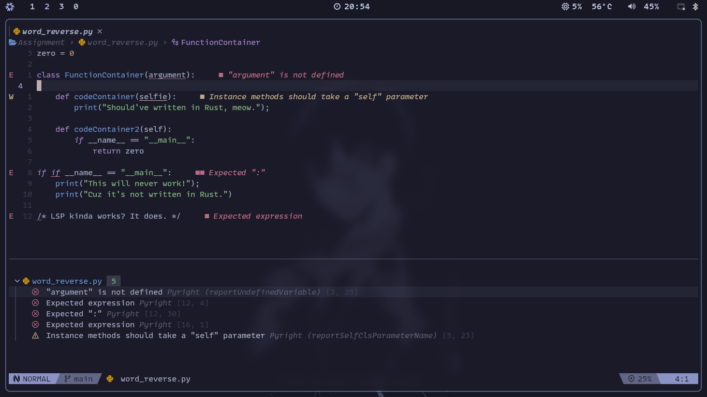
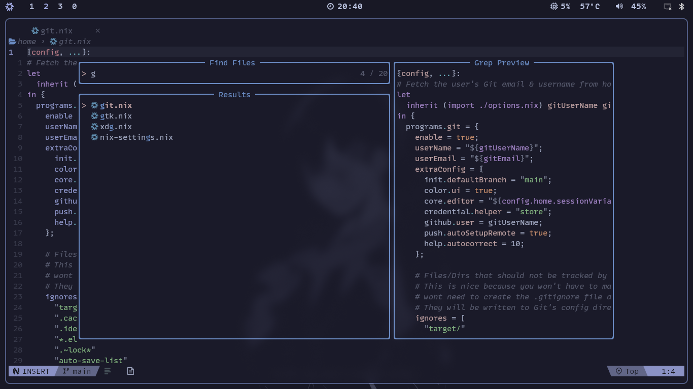
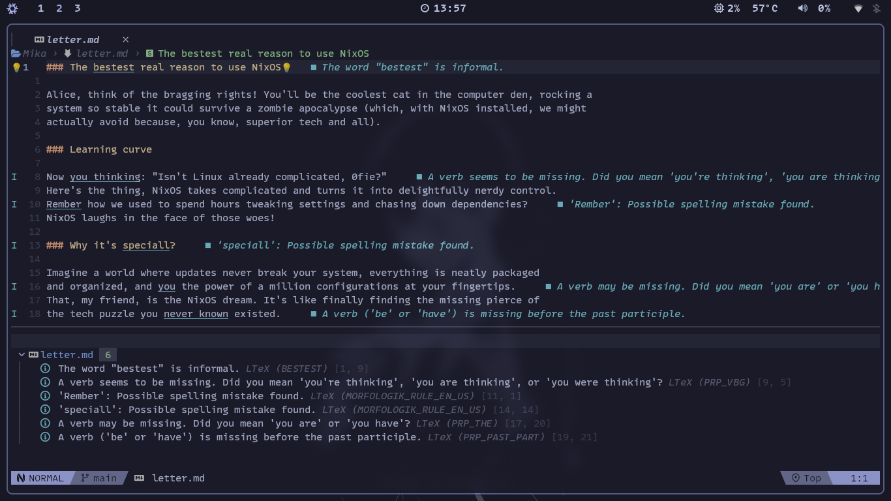

<div align="center"></div>

# Nixvim config

Mika (not to be confused with [Maika](https://github.com/0fie/Maika)) is my Neovim config using
[Nixvim](https://github.com/nix-community/nixvim).

<p align="center"></p>

<details>
  <summary>More Pics (click to expand)</summary>
  <p align="center">Telescope</p>
  <p align="center">Snippets</p>
  <p align="center">Offline spell & grammar checking</p>
  <p align="center">LSP* plugins for pictograms, emoji etc.</p>
</details>

## Configuring

To start configuring, just add or modify the nix files in `./config`.
If you add a new configuration file, remember to add it to the
[`config/default.nix`](../config/default.nix) file

### Current plugins

- **[AI/](../config/plug/ai)**

  - **[wtf](../config/plug/ai/wtf.nix):** AI powered diagnostic debugging.
  - **[backseat](../config/plug/ai/backseat.nix):** Uses GPT to highlight and explain code readability issues.

- **[Completion/](../config/plug/completion)**

  - **[nvim-cmp](../config/plug/completion/cmp.nix):** Completion plugin.
  - **[lspkind](../config/plug/completion/lspkind.nix):** VSCode-like pictograms for Neovim LSP completion items.

- **[Git/](../config/plug/git)**

  - **[gitsigns](../config/plug/git/gitsigns.nix):** Git integration for buffers.
  - **[lazygit](../config/plug/git/lazygit.nix):** The **best** git TUI, as a Neovim plugin.
  - **[worktree](../config/plug/git/worktree.nix):** Make using git worktrees easier.

- **[LSP/](../config/plug/lsp)**

  - **[conform](../config/plug/lsp/conform.nix):** Formatter plugin.
  - **[fidget](../config/plug/lsp/fidget.nix):** LSP progress notifications.
  - **[hlchunk](../config/plug/lsp/hlchunk.nix):** Highlight useful things like current chunk or indent lines.
  - **[lsp](../config/plug/lsp/lsp.nix):** LSP configurations.
  - **[lspsaga](../config/plug/lsp/lspsaga.nix):** Cool LSP features.
  - **[none-ls](../config/plug/lsp/none-ls.nix):** null-ls replacement. Use Neovim as LSP.
  - **[trouble](../config/plug/lsp/trouble.nix):** Pretty interface for working with LSP.

- **[Snippet/](../config/plug/snippet)**

  - **[luasnip](../config/plug/snippet/luasnip.nix):** Snippet engine in Lua.

- **[Treesitter/](../config/plug/treesitter)**

  - **[treesitter-context](../config/plug/treesitter/treesitter-context.nix):** Shows code context.
  - **[treesitter-textobject](../config/plug/treesitter/treesitter-textobject.nix):** Allow cool text manipulation thanks to TS.
  - **[treesitter](../config/plug/treesitter/treesitter.nix):** Parser generator tool to build a syntax tree of the current buffer.

- **[UI/](../config/plug/ui)**

  - **[alpha](../config/plug/ui/alpha.nix):** Dashboard.
  - **[bufferline](../config/plug/ui/bufferline.nix):** VSCode-like line for buffers.
  - **[catppuccin](../config/plug/ui/colorscheme.nix):** Based color scheme.
  - **[lualine](../config/plug/ui/lualine.nix):** Status line.
  - **[neoscroll](../config/plug/ui/neoscroll.nix):** Smooth scrolling.
  - **[noice](../config/plug/ui/noice.nix):** Better Neovim UI.
  - **[nvim-notify](../config/plug/ui/nvim-notify.nix):** Notification manager.
  - **[telescope](../config/plug/ui/telescope.nix):** Find, filter, preview and pick files.

- **[Extra Utilities/](../config/plug/utils)**
  - **[comment](../config/plug/utils/comment.nix):** Commenting.
  - **[dap](../config/plug/ui/dap.nix):** Debug in Neovim.
  - **[flash](../config/plug/ui/flash.nix):** Navigate in file with a few keystrokes.
  - **[grapple](../config/plug/ui/grapple.nix):** Quickly switch between buffers (Harpoon replacement).
  - **[hardtime](../config/plug/ui/hardtime.nix):** Learn Vim motions, the hard way.
  - **[harpoon](../config/plug/ui/harpoon.nix):** Quickly switch between buffers.
  - **[illuminate](../config/plug/ui/illuminate.nix):** Highlight word under the cursor.
  - **[nvim-autopairs](../config/plug/ui/nvim-autopairs.nix):** Autopairs plugin that supports multiple characters.
  - **[oil](../config/plug/ui/oil.nix):** Navigate in your working folder with a buffer.
  - **[search.nvim](../config/plug/ui/search.nix):** Adds useful tabs to Telescope.
  - **[ufo](../config/plug/ui/ufo.nix):** Folding plugin.
  - **[undotree](../config/plug/ui/undotree.nix):** Undo history visualizer.
  - **[whichkey](../config/plug/ui/whichkey.nix):** Popup to display keybindings.

## Testing your new configuration

To test your configuration simply run the following command

```
nix run .
```

If you have nix installed, you can directly run my config from anywhere

You can try running mine with:

```shell
nix run 'github:0fie/Mika'
```

## Installing into NixOS configuration

This `nixvim` flake will output a derivation that you can easily include
in either `home.packages` for `home-manager`, or
`environment.systemPackages` for `NixOS`. Or whatever happens with darwin?

You can add my `nixvim` configuration as an input to your `NixOS` configuration like:

```nix
{
 inputs = {
    nixvim.url = "github:0fie/Mika";
 };
}
```

### Direct installation

With the input added you can reference it directly.

```nix
{ inputs, system, ... }:
{
  # NixOS
  environment.systemPackages = [ inputs.nixvim.packages.${system}.default ];
  # home-manager
  home.packages = [ inputs.nixvim.packages.${system}.default ];
}
```

The binary built by `nixvim` is already named as `nvim` so you can call it just
like you normally would.

### Installing as an overlay

Another method is to overlay your custom build over `neovim` from `nixpkgs`.

This method is less straight-forward but allows you to install `neovim` like
you normally would. With this method you would just install `neovim` in your
configuration (`home.packges = with pkgs; [ neovim ]`), but you replace
`neovim` in `pkgs` with your derivation from `nixvim`.

```nix
{
  pkgs = import inputs.nixpkgs {
    inherit system;
    overlays = [
      (final: prev: {
        neovim = inputs.nixvim.packages.${system}.default;
      })
    ];
  }
}
```

### Bonus lazy method

You can just straight up alias something like `nix run "github:0fie/Mika"` to `nvim`.

## Credits

- This is a fork of [elythh/nixvim](https://github.com/elythh/nixvim). Most of the files were directly copied from there.
- [yavko](https://github.com/yavko) for the logo
